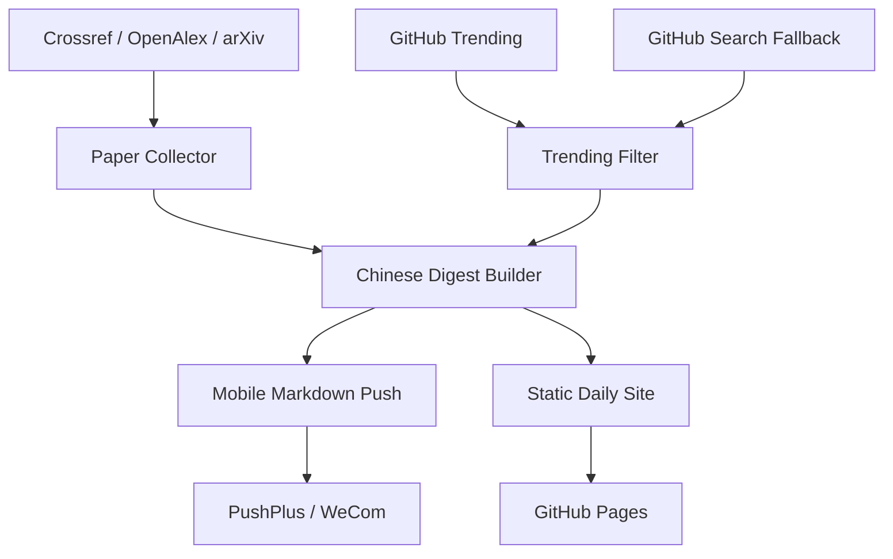

# Embodied AI Daily Report Cloud

[](https://github.com/docter2233/Daily-report-cloud/actions/workflows/daily-report.yml)
[](LICENSE)
[](requirements.txt)

中文机器人研究者的手机优先日报系统。  
A mobile-first daily digest system for embodied AI and robotics researchers.

它做的不是“把一堆原始链接推到微信”，而是：

- 先抓论文和 GitHub 项目
- 再自动整理成中文小文
- 再生成移动端网页
- 最后把适合手机阅读的摘要推到微信

电脑关机不影响运行，因为整个流程跑在 GitHub Actions 上。

## Why This Repo Exists

大多数“科研日报”都有同一个问题：

- 推送内容太原始，必须再去开 GitHub、翻 PDF、找论文页
- 手机端阅读体验很差，英文摘要堆在一起很难判断值不值得深挖
- GitHub Trending 噪声大，经常和具身智能主线关系不强
- 小文页只是摘抄，不会告诉你研究主旨、方法抓手和理论线索

这个仓库的目标是把“日报”从信息搬运，做成研究判断层。

## What It Does

- 手机推送只给中文摘要和小文链接，不再直接堆原始链接
- 每篇论文生成一页中文小文
- 每个 GitHub 项目生成一页“做什么 / 为什么推 / 怎么接进实验链路”的中文小文
- 论文选择优先做来源分散，避免长期被单一期刊淹没
- GitHub 先看 Trending，不够相关时自动补研究向仓库
- 只保留合法开放入口，不接入 Sci-Hub 或其他侵权资源

## Output Layers

每天会生成三层内容：

1. 手机推送摘要  
适合直接在微信里快速看 2-3 篇论文和 2-3 个项目。

2. 当日日报页  
一个聚合页，汇总当天所有论文和 GitHub 小文。

3. 条目详情页  
论文页会给出：
- 研究主旨
- 方法抓手
- 理论推导线索
- 实验与结果
- 阅读建议
- 合法获取入口

项目页会给出：
- 方向定位
- 为什么推它
- 对机器人研究的价值
- 怎么接进训练、仿真、规划或系统集成链路

## Architecture



## Core Features

- Multi-source paper collection
  - `Science Robotics`
  - `T-RO`
  - `IJRR`
  - `RA-L`
  - `Autonomous Robots`
  - fallback `arXiv cs.RO`
- GitHub dual-path selection
  - trending first
  - research-oriented fallback if trending is too noisy
- Chinese-first summaries for mobile reading
- Static site generation with daily archive pages
- Cloud scheduling and cloud push

## Quick Start

```powershell
python -m venv .venv
.venv\Scripts\Activate.ps1
pip install -r requirements.txt
python scripts/research_briefing.py collect --days 1 --max-papers 4 --max-repos 3 --public-base-url "https://example.com/"
python scripts/research_briefing.py run --days 1 --max-papers 3 --max-repos 3 --push-provider pushplus --dry-run --token dummy --public-base-url "https://example.com/"
```

重点查看：

- `artifacts/*-mobile.md`
- `site/index.html`
- `site/daily/<date>/index.html`
- `site/daily/<date>/papers/*.html`
- `site/daily/<date>/repos/*.html`

## Deploy To GitHub Pages

1. Push this repository to GitHub
2. Add `PUSHPLUS_TOKEN` in `Settings > Secrets and variables > Actions`
3. Set `Settings > Pages > Source` to `GitHub Actions`
4. Run `Daily Robotics Report` once from the Actions tab
5. Confirm:
- GitHub Pages is live
- WeChat receives the mobile digest
- The push message points to your own daily detail page

## Configuration

Main knobs live in [config/default_watchlist.json](config/default_watchlist.json).

Useful settings:

- `paper_candidate_pool_per_journal`
- `paper_per_venue_cap`
- `paper_target_venue_count`
- `paper_fallback_arxiv_query`
- `github_candidate_pool_size`
- `github_min_relevance_score`
- `github_fallback_min_relevance_score`
- `github_required_keywords_any`
- `github_fallback_queries`

## Repository Layout

- [scripts/research_briefing.py](scripts/research_briefing.py)
  - collection, filtering, orchestration, push
- [scripts/mobile_digest_helpers.py](scripts/mobile_digest_helpers.py)
  - Chinese digest writing and site rendering
- [config/default_watchlist.json](config/default_watchlist.json)
  - keywords, thresholds, source list, fallback rules
- [.github/workflows/daily-report.yml](.github/workflows/daily-report.yml)
  - scheduled cloud workflow

## Legal Boundary

- This project only keeps legal access links
- If OpenAlex, arXiv, or the publisher exposes an open PDF, it will be surfaced
- If no legal open full text exists, the project only keeps DOI, publisher page, or official landing page
- This repository does not integrate Sci-Hub or piracy-based download flows

## Why It Might Be Worth A Star

如果你也想要一个真正“手机能看、电脑能关机、内容不是噪声”的科研日报系统，这个仓库解决的是非常具体的需求：

- 中文用户
- 手机优先
- 具身智能 / 机器人研究
- 云端自动运行
- 输出的是判断，而不是原始链接垃圾桶

## Roadmap

- Better paper method extraction
- Stronger theory-line templates
- Better GitHub project categorization
- More push channels
- Example screenshots on the landing README

## Contributing

欢迎提 issue 和 PR。贡献方式见 [CONTRIBUTING.md](CONTRIBUTING.md)。

## License

MIT. See [LICENSE](LICENSE).
